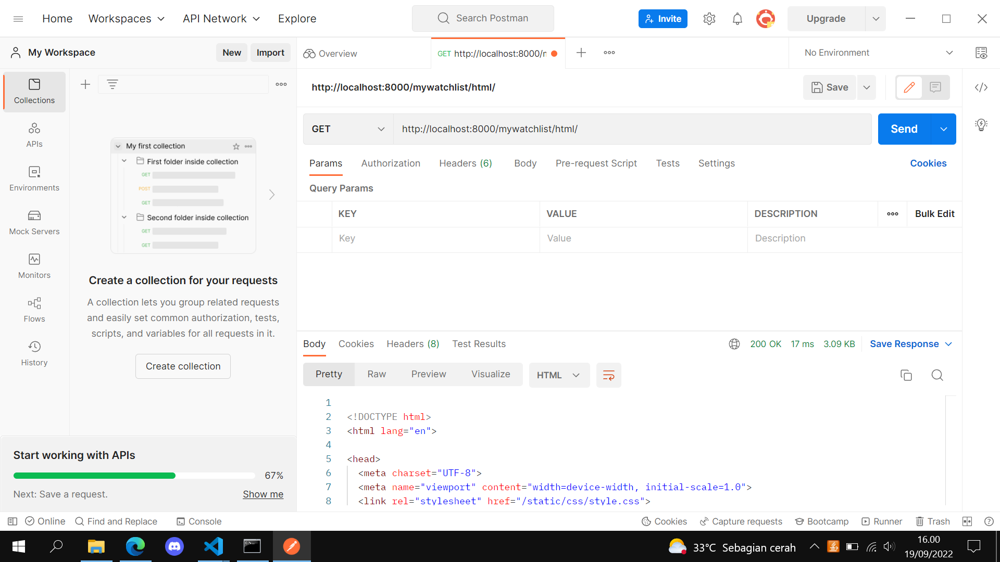
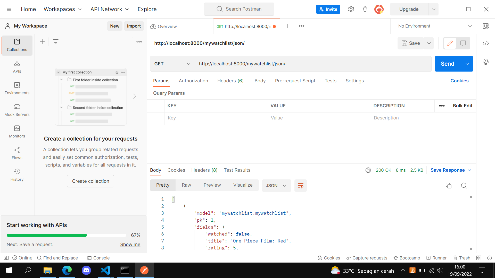
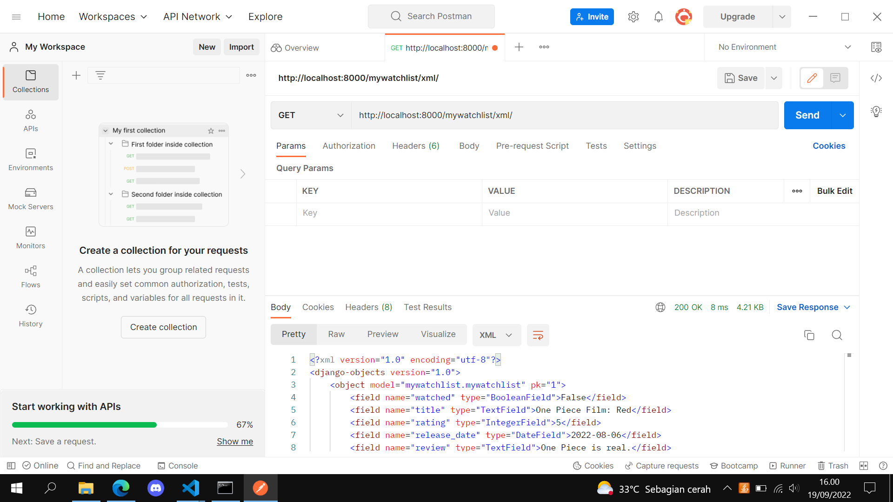

# Link HEROKU
http://tugas2-pbp-bian.herokuapp.com/mywatchlist/html/  
http://tugas2-pbp-bian.herokuapp.com/mywatchlist/xml/  
http://tugas2-pbp-bian.herokuapp.com/mywatchlist/json/  

# Perbedaan JSON, XML, dan HTML
- JSON dan XML merupakan file format yang digunakan untuk menyimpan data pada sebuah web server, sedangkan HTML digunakan untuk membuat tampilan yang akan muncul pada sebuah web browser. HTML juga bisa menampilkan data yang disimpan pada web server.
- JSON lebih mudah digunakan dibanding XML. JSON juga lebih cepat pada aplikasi-aplikasi AJAX.
- XML hanya bisa di-*parse* menggunakan XML *parser*, sedangkan JSON bisa di-*parse* menggunakan fungsi standar JavaScript.
- JSON menyimpan data-datanya dalam format *name/value*, sedangkan XML *start tag* dan *end tag*.

# Pentingnya *data delivery* dalam pengimplementasian sebuah platform
Hampir semua *platform* memiliki data yang harus diproses dan ditampilkan, terlebih jika *platform* tersebut digunakan oleh banyak *user* dan mengirimkan berbagai data dari satu *stack* ke *stack* lainnya. Jika proses tersebut dilakukan sembarangan, maka pengolahan data ini bisa memicu eror dan akan susah untuk diperbaiki. Untuk itu, diperlukan format data yang terstruktur dan efisien sehingga komputer dan bahkan manusia pun bisa dengan mudah memahami isi dari data yang tersimpan di *platform* tersebut.

# Implementasi *checklist*
1. Menjalankan *virtual environment* di direktori tugas ini dan menjalankan perintah
```
python manage.py startapp mywatchlist
```
2. - Tambahkan `"mywatchlist",` di variable `INSTALLED_APPS` di dalam file `settings.py` yang ada pada folder `project_django`.
   - Tambahkan `path('mywathclist/', include('mywatchlist.urls')),` ke dalam variabel `urlpatterns` di dalam file `urls.py` yang ada pada folder `project_django`. Dengan demikian, kita bisa mengakses link http://localhost:8000/mywatchlist.
3. Menambahkan kode berikut pada file `models.py` yang ada di dalam folder `mywatchlist`.
   ```
   class MyWatchList(models.Model):
       watched = models.BooleanField()
       title = models.TextField()
       rating = models.IntegerField()
       release_date = models.DateField()
       review = models.TextField()
   ```
4. Membuat sebuah folder bernama `fixtures` dan sebuah file di dalam folder tersebut yang bernama `initial_mywatchlist_data.json` yang berguna untuk menyimpan 10 data dari objek `MyWatchList`.
5. - Implementasi HTML
     - Membuat folder bernama `templates` dan file `html` bernama `mywatchlist.html` pada folder tersebut yang berguna untuk menampilkan data-data yang tersimpan.
     - Membuat fungsi `show_mywatchlist` pada file `views.py` yang ada di dalam folder `mywatchlist` yang berguna untuk mengirimkan data dan menampilkannya di `mywatchlist.html`.
     - Melakukan `migrate` dan `loaddata` sehingga model yang kita buat beserta data-datanya bisa tersimpan pada *database* Django lokal kita.
   - Implementasi XML dan JSON  
     Menambahkan *import* berikut pada file `views.py` yang ada pada folder `mywatchlist`.
     ```
     from django.http import HttpResponse
     from django.core import serializers
     ```
     Lalu, membuat fungsi `show_mywatchlist_<file_format_type>` pada file yang sama sebagai berikut.
     ```
     def show_mywatchlist_<file_format_type>(request):
         data = MyWatchList.objects.all()
         return HttpResponse(serializers.serialize("<file_format_type>", data), content_type="application/<file_format_type>")
     ```
     `<file_format_type>` diganti dengan `xml` atau `json` sesuai dengan kegunaan fungsi tersebut apakah untuk menampilkan dalam format `xml` atau `json`.
6. Membuat file `urls.py` yang ada di dalam folder `mywatchlist` yang berisikan kode berikut.
   ```
   from django.urls import path
   from mywatchlist.views import show_mywatchlist, show_mywatchlist_xml, show_mywatchlist_json

   app_name = 'mywatchlist'

   urlpatterns = [
       path('html/', show_mywatchlist, name='show_mywatchlist'),
       path('xml/', show_mywatchlist_xml, name='show_mywatchlist_xml'),
       path('json/', show_mywatchlist_json, name='show_mywatchlist_json'),
   ]
   ```
7. Melakukan *push* ke GitHub saja karena repo yang digunakan adalah repo tugas sebelumnya yang sudah di-*setup* agar bisa melakukan *deployment* ke Heroku.

# Screenshot Postman
## HTML

## JSON

## XML
